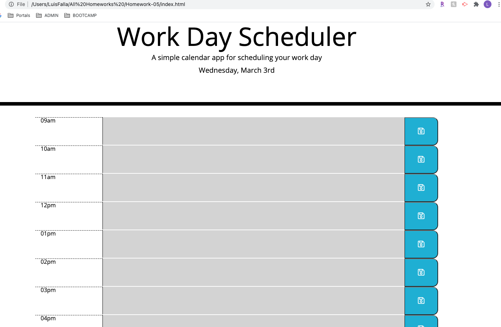

# Homework 05 -  Work Day Scheduler 

## Link to site
* [Live Link](https://chronoslou.github.io/HW5/) 
* [Repo README Link](https://github.com/chronoslou/HW5) 

## Description

This is a JQuery powered calendar application that allows an employee to save important events for each hour of the day, it will run in browswer and will dynamically update HTML and CSS. 

The Moments library is leveraged for this planner. 

## Usage

The app will should perfom the following logic:

* The app will allow the user to create a schedule
* The current day will be displayed at the top of the calendar
* When scrolling down, the user is presented with timeblocks for standard business hours (9a -5p)
* User will have the ability to view the timeblocks for that day
* Each timeblock is color coded to indicate whether it is in the past, present, or future
* The user has the ability to click into a timeblock and enter an event
* The user has the option to save content through a button for a timeblock
* The entry for that timeblock is saved in local storage
* The user has the option see saved events when the browser is refreshed

## Preview of App 

* This is how the app looks

# Lincense
* MIT

